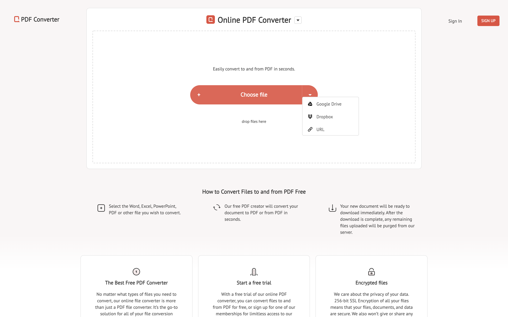

# markdown-cv

A curriculum vitae maintained in plain text and rendered to HTML and PDF using CSS.

For more details, see the [project page](http://elipapa.github.io/markdown-cv), or the blog post on [why I switched to markdown for my CV](http://elipapa.github.io/blog/why-i-switched-to-markdown-for-my-cv.html).

## Customization

Simply [fork the markdown-cv repo](https://github.com/elipapa/markdown-cv)

and edit the `index.md` file [directly in Github](https://help.github.com/articles/editing-files-in-your-repository/)

adding your skills, jobs and education.

## Distribution

To transform your plain text CV into a beautiful and shareable HTML page, you have two options:

### I. Use Github Pages to publish it online

1. Delete the existing `gh-pages` branch from your fork. It will only contain this webpage. You can either use git or [the Github web interface](https://help.github.com/articles/creating-and-deleting-branches-within-your-repository/#deleting-a-branch).

2. Create a new branch called `gh-pages`.

3. Head to *yourusername*.github.io/markdown-cv to see your CV live.

Any change you want to make to your CV from then on would have to be done on the `gh-pages` branch and will be immediately rendered by Github Pages.

### II. Build it locally and print a PDF

1. To [install jekyll](https://jekyllrb.com/docs/installation/), run `gem install bundler jekyll` from the command line.

2. [Clone](https://help.github.com/en/articles/cloning-a-repository) your fork of markdown-cv to your local machine.

3. Type `jekyll serve` to render your CV at http://localhost:4000.

4. You can edit the `index.md` file and see the changes live in your browser.

5. To print a PDF, press <kbd>⌘</kbd> + <kbd>p</kbd>. Print and web CSS media queries should take care of the styling.

### Alternative to Local Build
    1.Visit https://www.freepdfconvert.com/
    2. Select best option.
    

## Styling

The included CSS will render your CV in two styles:
s
1. `kjhealy` the original default, inspired by [kjhealy's vita
template](https://github.com/kjhealy/kjh-vita).

2. `davewhipp` is a tweaked version of `kjhealy`, with bigger fonts and dates
  right aligned.

To change the default style, simply change the variable in the
`_config.yml` file.

Any other styling is possible. More CSS style contributions and forks are welcome!

## References
###### [Back to Table of Contents](#Table-of-Contents)
1.  [Shields IO](https://shields.io/) provides documentations on how to add your shield, for creditbility.  Please feel free to view this resource, for your future developments.

2.  [Markdown Syntax](https://www.markdownguide.org/basic-syntax/) provides documentations on how to add your shield, for creditbility.  Please feel free to view this resource, for your future developments. 

### Author

Eliseo Papa ([Twitter](http://twitter.com/elipapa)/[Github](http://github.com/elipapa)/[Website](https://elipapa.github.io))

### Contributors

  &nbsp;&nbsp;&nbsp;&nbsp;&nbsp;

  Select images above to visit the contributor's GitHub Profile.  Names following images left to right: aloupfor, Benjamin L. Moore, Zoë Peterson,and Frederick Thomas, Super Coding Ninja™

## License

<b>markdown-cv</b> Copyright (c) [2021] [Eliseo Papa](https://github.com/elipapa), [Aloupfor](https://github.com/aloupfor), [Benjamin L. Moore](https://github.com/blmoore), [Zoë Peterson](https://github.com/zpeterson), and [Frederick Thomas](https://github.com/supercodingninja)

Permission is hereby granted, free of charge, to any person obtaining a copy of this software and associated documentation files (the "Software"), to deal in the Software without restriction, including without limitation the rights to use, copy, modify, merge, publish, distribute, sublicense, and/or sell copies of the Software, and to permit persons to whom the Software is furnished to do so, subject to the following conditions:

The above copyright notice and this permission notice shall be included in all copies or substantial portions of the Software.

THE SOFTWARE IS PROVIDED "AS IS", WITHOUT WARRANTY OF ANY KIND, EXPRESS OR IMPLIED, INCLUDING BUT NOT LIMITED TO THE WARRANTIES OF MERCHANTABILITY, FITNESS FOR A PARTICULAR PURPOSE AND NONINFRINGEMENT. IN NO EVENT SHALL THE AUTHORS OR COPYRIGHT HOLDERS BE LIABLE FOR ANY CLAIM, DAMAGES OR OTHER LIABILITY, WHETHER IN AN ACTION OF CONTRACT, TORT OR OTHERWISE, ARISING FROM, OUT OF OR IN CONNECTION WITH THE SOFTWARE OR THE USE OR OTHER DEALINGS IN THE SOFTWARE.
