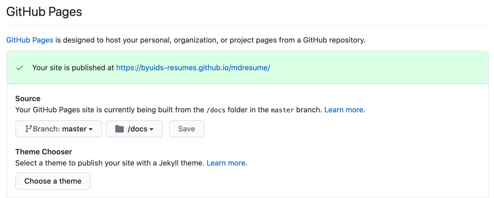

# md-resume

A resume maintained in plain text and rendered to HTML and PDF using CSS.

For more details, see the [markdown-csv project page](http://elipapa.github.io/markdown-cv), or the blog post on [why I switched to markdown for my CV](http://elipapa.github.io/blog/why-i-switched-to-markdown-for-my-cv.html).

***

## Customization

Simply [fork the mdresume repo](https://github.com/byuids-resumes/mdresume)

and edit the `index.md` file in the `docs` folder [directly in Github](https://help.github.com/articles/editing-files-in-your-repository/)

adding your skills, jobs and education.

## Distribution

To transform your plain text resume into a beautiful and shareable HTML page, you have two options:

### I. Use Github Pages to publish it online

1. Edit or move your resume to the `index.md` file in the `docs` folder.
2. Go to settings > GitHub pages to make the changes shown.

3. Head to *yourusername*.github.io/mdresume to see your resume live.

Any change you want to make to your CV from then on would have to be done in the `docs` folder and will be immediately rendered by Github Pages.

## Styling

The included CSS will render your CV in two styles:
s
1. `kjhealy` the original default, inspired by [kjhealy's vita
template](https://github.com/kjhealy/kjh-vita).
2. `davewhipp` is a tweaked version of `kjhealy`, with bigger fonts and dates
  right aligned.

To change the default style, simply change the variable in the
`_config.yml` file.

Any other styling is possible. More CSS style contributions and forks are welcome!

### Author

Eliseo Papa ([Twitter](http://twitter.com/elipapa)/[Github](http://github.com/elipapa)/[Website](https://elipapa.github.io)).

### License

[MIT License](https://github.com/elipapa/markdown-cv/blob/master/LICENSE)
