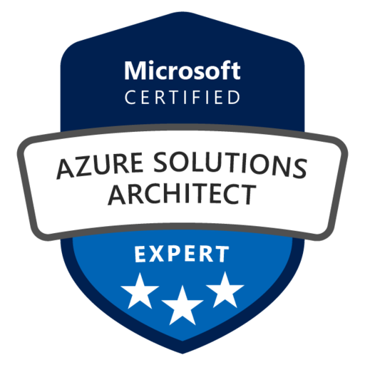

  
    

# Vipin Pillai 
## Cloud Architect Specialized in DevOps and Infrastructure as Code 
 
 

    
    
    

 
 

## Professionaly Summary

Experienced IT professional with a strong focus on DevOps and Cloud Architecture. Demonstrates in-depth expertise in cloud-native technologies and a successful history of implementing scalable and resilient cloud solutions.
Proficient in Azure solutioning, Terraform, Docker, Kubernetes, and CI/CD pipelines, actively seeking opportunities to drive innovation and streamline processes to achieve exceptional outcomes.

 

## Skills

- ### Azure Devops
- ### Cloud Solutions
- ### Cloud Automation
- ### Infra as Code
- ### Employee Training

 

## Experience

### Manager -Global Cloud 
#### Teleperformance  `July 2021 - Present`
- Built and managed the company's Azure cloud infrastructure using Terraform, developing and implementing DevOps processes to streamline software development and deployment.
- Orchestrated automated pipelines with Azure DevOps and Git, enabling continuous integration and delivery of applications.
- Implemented Power Apps Infrastructure as Code (IAC) on Azure to improve application lifecycle management and resource provisioning.
- Utilized Logic Apps to design and orchestrate business workflows across multiple services and systems in Azure.
- Developed and deployed Function Apps to Azure for serverless computing and event-driven applications.
- Established security measures and enforced compliance policies to safeguard data integrity and privacy, including managing Kubernetes clusters.
- Developed automation scripts using Azure automation Run-books to improve cloud management and streamline tasks.
- Contributed to the development of best practices for DevOps and agile methodologies in the context of Kubernetes and Azure infrastructure.

 

### Technical Consultant -Cloud
#### Skilliantech (On-site: Genpact) `February 2021 - July 2021`
- Azure network experience, VPN and Express route, Azure DNS, Traffic Manager, and Web Application Firewalls.
- Troubleshoot and resolve issues in our production environments, assisting in the development and test environments when needed.
- Automated deployment of VM, storage, virtual network, virtual machine scale set using PowerShell.
- Developed training documentation and Standard Operating Procedures for new joiners.
- Performed cost analysis and budgeting for datacentre migration using azure price calculator.

 

### Associate Consultant
#### Comparex, SoftwareOne `May 2017 - Jan 2021`
- System and Application Infrastructure Implementation, Virtual Machines Configuration.
- Datacenter Migration using Azure Site Recovery Tool.
- Virtual Network Infrastructure Configuration, Network Connectivity Configuration (On-premises & Azure Services).
- Network Security Configuration (NSG, RBAC, NVA), High Availability & Load Balancing Implementation.
- Azure Backup Server & Recovery Vault Management.
- POC Development for New Clients & Azure Cloud Services.

 

### Engineer -Support
#### Comparex `Dec 2015 - Oct 2016`
- Technical support and assistance for cloud infrastructure, services, and applications.
- Remote and on-site troubleshooting for cloud-related issues.
- Monitoring and responding to alerts for cloud infrastructure and services.
- Installation, configuration, and troubleshooting of cloud infrastructure components.
- Regular maintenance activities including backups, security checks, health checkups and updates.
- Inventory Management & Reporting.

 

### Infrastructure Administrator
#### Magna Infotech (On-site: Sapient) `Dec 2014 - Oct 2015`
- IT Support, Software Licenses, Warranties, Maintenance Agreements, and Vendor Contracts Central Repository Management.
- Regular Security Monitoring and Daily Backup Operations in Cloud Environment.
- Investigation and Troubleshooting of IT Infrastructure Issues for Internal Teams or Clients.
- Operational, Configuration, or Other Procedures Maintenance.
- Regular Updates and Upgrades Management.
- Cloud-based Server Backup Support and Maintenance.

 

### Associate IT
#### India Data Entry Services `Sep 2012 - Dec 2014`
- Providing technical support and assistance to end-users on hardware, software, and network-related issues in the local environment.
- Resolving technical problems through remote and on-site support while maintaining excellent customer service skills.
- Installing, configuring, and troubleshooting desktops, laptops, printers, and other peripherals.
- Performing regular maintenance activities on local IT infrastructure, including backups, security checks, and software updates.
- Monitoring and responding to alerts related to local IT systems, and escalating issues as necessary to the next level of support.

 

## Educational Qualification

- Graduation: Bachelors in Computer Application Sri Satya Sai University of Technology & Medical Sciences
- HashiCorp Certified **Terraform Associate** (003)
- Microsoft Certified **Azure Solutions Architect** Expert (AZ-305)
- Microsoft Certified **DevOps Engineer** Expert (AZ-400)
- Microsoft Certified Microsoft **Azure Administrator** (AZ-104)

 

## Hobbies

- Nature Hiking: I find solace in exploring the great outdoors and connecting with nature.
- Avid Reader: Stay informed through technical blogs, fostering continuous learning and industry awareness.
- Music Enthusiast: Seek comfort through music, using it as a calming mechanism.

   

__Thank You!__
